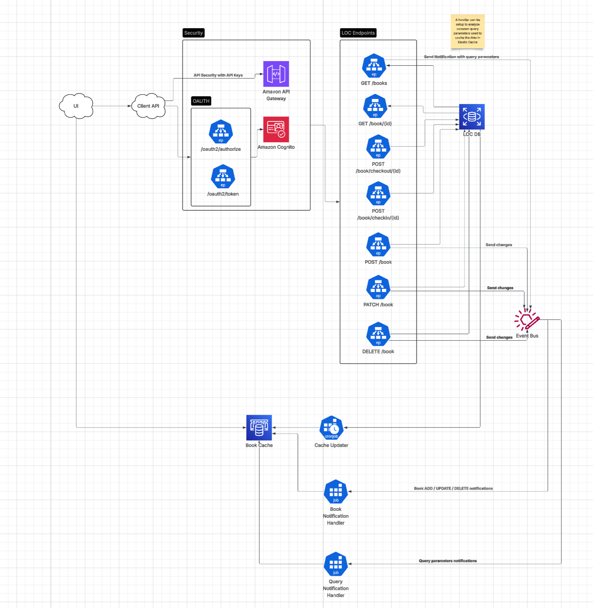

# Online Library of Congress

## Architecture



##### SLA of 99.999%

My suggestion for this would be to distribute the microservice across multiple availability zones. Also the use of EKS for the auto replacement of any nodes that become unhealty.

Note: For this I /health endpoint will need to be added to the microservice.

For the RDS database and cache would be a similar approach. Deploy it in a multiple availability zones.

For the case of disaster recovery, i would recommend to use S3 cross region replication as well as backing up with AWS Backup.

Also, an ELB can be used to direct traffic and help facilitate scaling of services.

And of course, extend the service to provide structured logging data to a service like Datadog. There, alerts can be created to notify responsible parties of any issues reported by the services. Monitors can be created also to help keep track the health of the overall system.

#### Future extensions of the service to make it mission critical

* While security is described in the architecture, it is yet to be implemented in the service.
* There is a package for logging but this will need to be extended to be a structed logging using a package like [ZeroLog](github.com/rs/zerolog)
* Unit testing needs to be added
* Use of configufation manager (like Viper) would help with the construction of service configuration and secrets
* All indexes are BTree type.  As the service grows, we need to consider the possibility to change them to Hash indexes.
* Use of local cache or a sevice like MemCache or Redis to store query responses with a sliding cleanup
* And more time and patience to think of all the things I did not :)
* Instead of sql scripts, change it to use a tool like DBMigrate for the promotion / demoting of DB features

## Endpoints

### Get Books (book search)

GET /books

Method: GET
Query Parameters:

* title (wildcard case insensitive search)
* genre (wildcard case insensitive search)
* publisher (wildcard case insensitive search)
* isbn (exact match)
* author (wildcard case insensitive search)

##### Sample Query:

```
curl --location 'http://localhost:8080/book?title=The&isbn=978-0-439-02348-1&publisher=har&genre=DRA&author=gri'
```

### Get Book (book retrieval)

GET /book/{id}

Method: GET
Query Parameters: None
URL Parameters:

* bookID (required)

##### Sample Query:

```
curl --location 'http://localhost:8080/book/1'
```

### Checkout a Book

POST /book/checkout

Method: POST
Query Parameters: None
URL Parameters: None
Body:
{
bookID string
userID string
}

##### Sample Query:

```
curl --location 'http://localhost:8080/book/checkout' \
--header 'Content-Type: application/json' \
--data '{
    "book_id": 5,
    "user_id": 2,
    "created_by": "david"
}'
```

### Checkin a Book

POST /book/checkout

Method: POST
Query Parameters: None
URL Parameters: None
Body:
{
bookID string
userID string
}

##### Sample Query:

```
curl --location 'http://localhost:8080/book/checkin' \
--header 'Content-Type: application/json' \
--data '{
    "book_id": 5,
    "user_id": 2,
    "created_by": "david"
}'
```